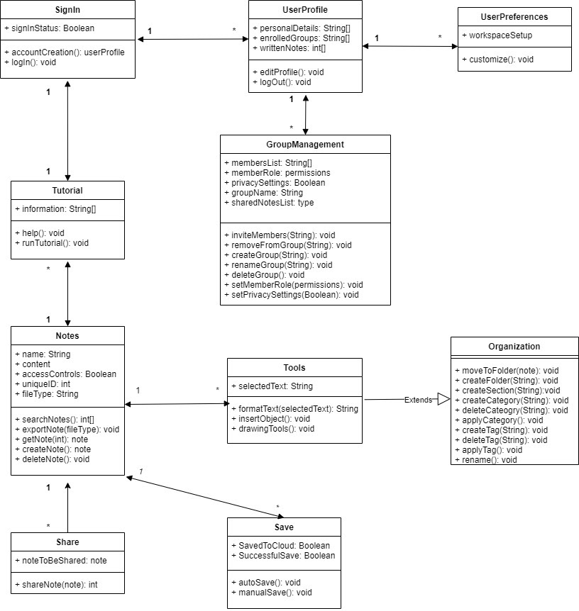

# Analysis

## 1. System Description
Taking quality notes can be difficult when trying to keep up with lectures or work meetings while using unnecessarily complex note-taking apps. For anyone who wants to take quality notes while staying engaged in a conversation or
lecture, Lumberjack Notes is a free application that helps students and professionals enhance their note-taking ability by providing a more accessible way to organize and share ideas. Most note-taking apps are unnecessarily complex and hinder student/professional performance. Unlike other famous note-taking apps like Evernote, our app will be focused on simplicity, accessibility and mobile-centered performance.

## 2. Model
