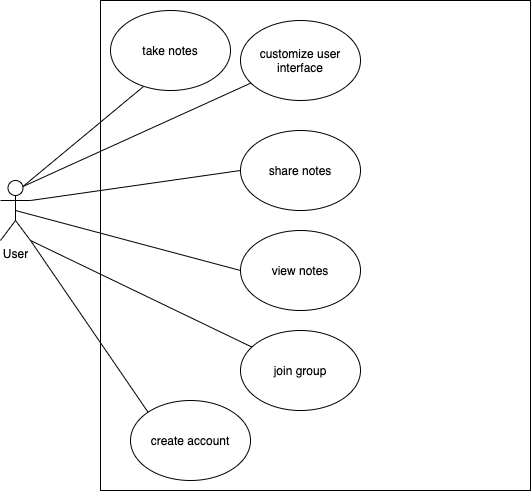

# Requirements
Group 04 - "[Lumberjack Notes]"  
Date and location: February 21, 2021  
Group Members: Gustavo Valencia, Armando Martinez, Stefan Mihailovic, Nicholas Botticelli, Collin Rampata, Kyle Austria

## 1. Positioning
### 1.1. Problem statement

The problem of most note-taking apps is that their unnecessary complexity affects students and professionals, the impact
of which is an inefficient workflow.

### 1.2. Product position statement

For students and professionals who need a more efficient way to take detailed notes, Lumberjack Notes is a note-taking
app that provides an accessible way to organize and share ideas, providing cloud sharing access to comfortably share
your notes with other students and colleagues; unlike other famous note-taking apps like Evernote, our app will be
focused on simplicity, accessibility and mobile-centered performance to help users stay more engaged while taking notes.

### 1.3. Value proposition and consumer segment

**Value Proposition:**

Lumberjack Notes is a free note-taking application designed to help students and professionals collaborate and share
their notes with their colleagues.

**Consumer Segment:**

High school students, university students, and professionals that need a more efficient way to take detailed notes.

## 2. Stakeholders

**Users:** High school students, university students, and professionals.  
**Clients:** Academic Institutions and Businesses.  
**Competitors:** Evernote.  
**Developers:** Gustavo Valencia, Armando Martinez, Stefan Mihailovic, Nicholas Botticelli, Collin Rampata, and Kyle Austria.

## 3. Functional requirements

- Note-taking: Ability to take notes within the application
- Note Sharing: Being able to share notes with colleagues.
- Ease of Use: Effective user interface.
- Customizability: Dark mode, default fonts, and moveable/removeable interface elements.

## 4. Non-functional requirements

- Availability: Assurance that servers are always operating.
- Security: Protection of user credentials and data.
- Learnability: Providing an intuitive and user-friendly user interface.
- Usability: Providing several tools to ensure efficient note-taking.

## 5. MVP

Our minimum viable product (MVP) will be an application that is initially composed of our four functional requirements,
which will include note-taking, note sharing, ease of use, and customizability. This will allow our application to be in
a state in which the functional requirements can be tested to confirm quality by limited participants within our consumer
segment. We will focus the majority of our efforts at the start on creating a platform that will allow the user to save and
create notes. After which, we will implement the rest of our functional requirements, like customization, and note sharing.

## 6. Use cases

### 6.1. Use case diagram

### 6.2. Use case descriptions and interface sketch

**Use Case**: Take Notes  
**Actor**: User  
**Description**: The user creates a page where they are able to take notes  
**Preconditions**: The user has created an account on the platform  
**Post-conditions**: The user should have a workspace where they can take and edit notes  
**Main Flow**:
1. The user selects a workspace
2. The user can write or draw notes
3. The user should be able to save their notes and come back to them at a later date

**Alternate Flow**:
- None

**Use Case:** Create group  
**Actor:** User  
**Description:** The user creates a group to share notes with colleagues   
**Preconditions:** User is not part of a group or wants to start an existing group   
**Post-conditions:** Created private or public group  
**Main Flow:**
1. The user adds a new group
2. The user sets group name
3. The user sets privacy settings

**Alternate Flow:**  
3. Other people join group without needed permission (in the case of public groups)

**Use Case**: Customize user interface  
**Actor**: User  
**Description**: The user customizes various app functionality to fit their needs  
**Preconditions**: The user has created an account on the platform  
**Post-conditions**: User interface is adjusted according to customizations  
**Main Flow**:
1. The user views the current settings of the application
2. The user configures the desired settings the way they want  

**Alternate Flow**:
- None

**Use Case**: View notes  
**Actor**: User  
**Description**: The user is provided access to their notes.  
**Preconditions**: The user has an account  
**Post-conditions**: The user can edit their notes or share them  
**Main Flow**:
1. The user selects the notes they want to view
2. The user gets access to the notes
3. The user is given the options to either edit their notes or share them

**Alternate Flow**:
- None

**Use Case**: Create an account  
**Actor**: User  
**Description**: The user creates an account so they can use the application  
**Preconditions**: The user does not have an account in the system  
**Post-conditions**: The user has created an account and is registered in the system  
**Main Flow**:
1. The user downloads the application and opens it
2. The user inputs their account information

**Alternate Flow**:
2. If the user already has an existing account, they can input their account credentials and log in.

## 7. User stories
- “As a college student, I want to be able to insert documents into my notes so I can annotate and write other notes around them.”
- “As a college student, I want to be able to snip and resize drawings in my notes so I can better organize my notes.”
- "As a college student, I want to be able customize my note-taking workspace to fit my specific needs to enhance my
experience."
- “As a college student, I want to be able to take notes while still staying actively engage in class so that I can grasp
information more efficiently and have quality notes to look back through."
- "As a group member, I want to be able to share my notes with other members so that we can all learn and receive
information as a whole."
- As a college student, I want to be able customize my note-taking workspace to fit my specific needs to enhance my
experience.
- “As a college student, I want to be able to share my notes with my colleagues so that I can spot potential errors and
gain further insight.”
- “As a professional, I want to be able to group my documents into folders so that I can keep each of my projects
organized.”
- “As a college student, I want an easy to use interface that lets me get to the note taking part quickly so that I can make the most out of my time in classes.”
- “As a college student, I would like to be able to share my notes with my classmates so that we can collaborate and study better as a whole.”

## 8. Issue tracker
